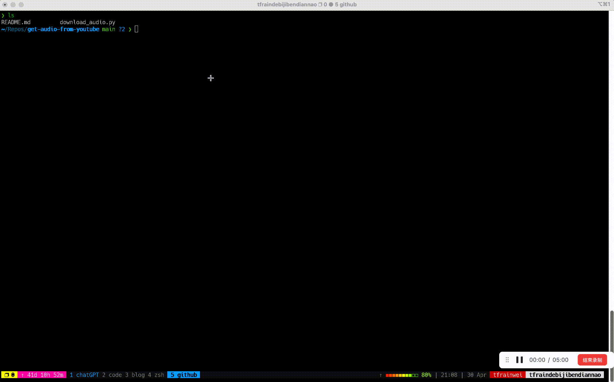

# Get Audio From Youtube

A python script help you get audio from youtube on Macbook. 

Please note that this program is intended for learning and personal amusement only. We encourage responsible and ethical use of our script. 

As seen on [Medium](https://medium.programmerscareer.com/extracting-audio-from-youtube-videos-using-python-script-62477d2e36ea)


## Demo



If you want to hear the sound, Here is a youtube link 👇. 
[](https://www.youtube.com/watch?v=YPgTZxwiD50)

## Install on Macbook
1. install ffmpeg
``` shell
brew install ffmpeg
```
ffmpeg needs more time to download

2. install python lib
``` shell
pip3 install youtube-search-python
pip3 install rich
pip3 install questionary
python3 -m pip install --force-reinstall https://github.com/yt-dlp/yt-dlp/archive/master.tar.gz
```
3. download audio
``` shell 
python3 download_audio.py "learn english"
```

## Notice
You should check the description and attribution details of the video to verify permissions before downloading a audio from YouTube. 👀

## Buy Me a Coffee

[](https://ko-fi.com/programmerscareer)


## Stargazers over time
[](https://starchart.cc/tfrain/get-audio-from-youtube)